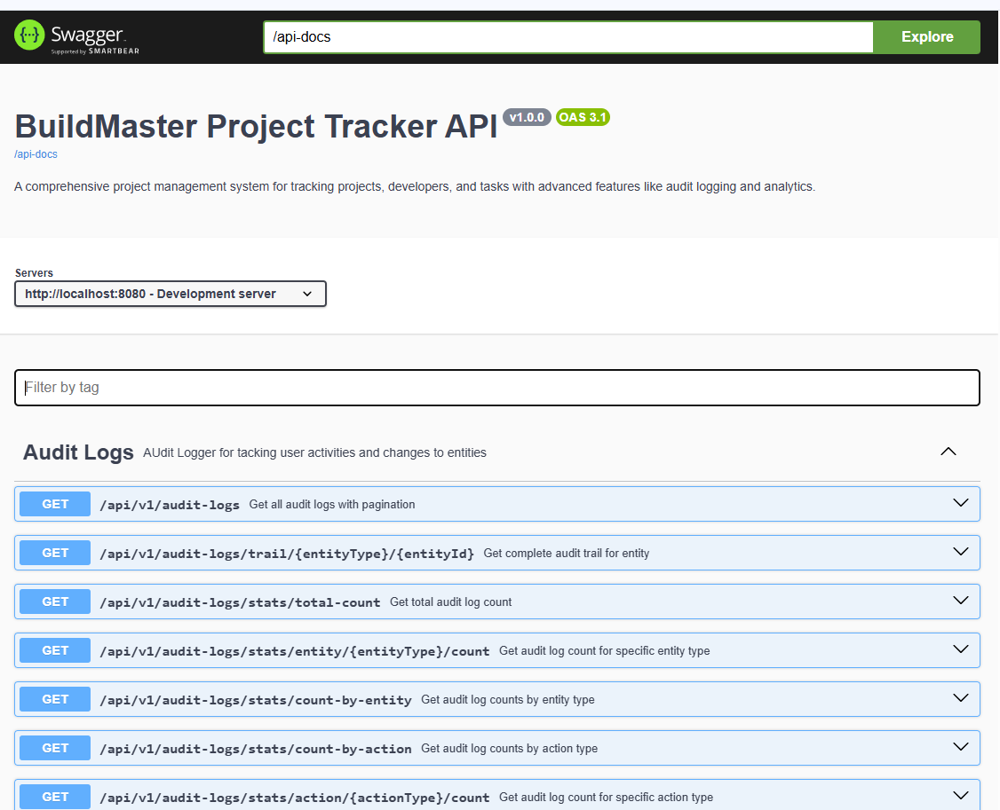
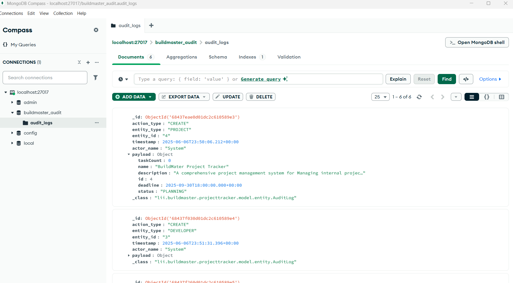

# BuildMaster Project Tracker

A Spring Boot  REST API featuring hybrid database architecture (PostgreSQL + MongoDB), advanced caching, audit logging, and professional REST APIs.


## 🎯 Overview

BuildMaster Project Tracker is an project management system that provides a user with the functionality of tracking of projects, developers, and tasks, updating entries and extra features for logging audits, caching and summary analysis of projects task and developers.

### Key Features 

- **Complete Project Tracker** for Projects, Developers, and Tasks
- **Advanced JPA Relationships** with proper cascade operations
- **Hybrid Database Architecture** (PostgreSQL for relational data, MongoDB for audit logs)
- **High-Performance Caching** with Caffeine
- **Transaction Management** with proper isolation
- **Comprehensive Audit Logging** with MongoDB
- **Interactive API Documentation** with Swagger/OpenAPI
- **RESTful API Design** with versioning support
- **Docker Support** with multi-container setup
- **Pagination & Sorting** for all endpoints
- **Advanced Search & Filtering** capabilities by status, duedate, developer,task, project etc

## 🏛️ Architecture Overview


### Project Structure 🗂️
```
projecttracker/
├── docs/                        # Docs Contains documents including postman json
├── src/
│   ├── main/
│   │   ├── java/lii/buildmaster/projecttracker/
│   │   │   ├── annotation/      #Custom annotation interface
│   │   │   ├── Aspect/          # Customer aspect implementation
│   │   │   ├── config/          # Configuration classes
│   │   │   ├── controller/      # REST controllers
│   │   │   ├── exception/       # Custom exceptions
│   │   │   ├── mapper/          # Mapper Mapping entities and DTOs
│   │   │   ├── model/           # Domain model including entity, enums, and dto
│   │   │   ├── repository/      # Data access
│   │   │   └── service/         # Business logic
│   │   │   └── util/            # 
│   │   └── resources/           # Properties files
│   └── test/                    # Unit tests
├── docs/                        # Documentation
├── Dockerfile                   # Docker configuration
├── docker-compose.yaml          # Docker containers configuration
└── pom.xml                      # Maven dependencies
```
### System Architecture

### Technology Stack

| Layer | Technology        | Purpose |
|-------|-------------------|---------|
| **API Layer** | Spring Boot 3.5.0 | REST API framework |
| **Data Access** | Spring Data JPA   | ORM and repository pattern |
| **Caching** | Caffeine          | High-performance in-memory cache |
| **Validation** | Bean Validation   | Input validation |
| **Documentation** | SpringDoc OpenAPI | Interactive API documentation |
| **Database (Primary)** | PostgreSQL 17     | Relational data storage |
| **Database (Audit)** | MongoDB 8.0       | Document-based audit logging |
| **Build Tool** | Maven 4.0+        | Dependency management and build |
| **Containerization** | Docker            | Application containerization |

## 🚀 Quick Start

### Prerequisites

- **Java 21** or higher
- **Maven 3.6+**
- **Docker & Docker Compose** (for containerized setup)
- **PostgreSQL 17+** (for local setup)
- **MongoDB 8.0+** (for local setup)

### Option 1: Docker Setup (Recommended)

1. **Clone the repository**
   ```bash
   git clone https://github.com/Tabari-Linus/buildmasterprojecttracker.git
   cd buildmaster-project-tracker
   ```

2. **Start all services with Docker Compose**
   ```bash
   docker-compose up -d
   ```

3. **Verify services are running**
   ```bash
   docker-compose ps
   ```

4. **Access the application**
    - **API**: http://localhost:8080
    - **Swagger UI**: http://localhost:8080/swagger-ui.html
    - **MongoDB Admin**: http://localhost:8081 (admin/admin123)

### Option 2: Local Development Setup

1. **Start PostgreSQL**
   ```bash
   # Update connection details in application.properties
   spring.datasource.url=jdbc:postgresql://localhost:5432/buildmaster_db
   spring.datasource.username=your_username
   spring.datasource.password=your_password
   ```

2. **Start MongoDB**
   ```bash
   # Default connection (localhost:27017)
   mongod
   ```

3. **Run the application**
   ```bash
   mvn spring-boot:run
   ```


## 🗄️ Database Schema

### PostgreSQL Schema (Main Data)

```sql
CREATE TABLE projects (
    id BIGSERIAL PRIMARY KEY,
    name VARCHAR(100) NOT NULL,
    description VARCHAR(500),
    deadline TIMESTAMP NOT NULL,
    status VARCHAR(20) NOT NULL,
    created_at TIMESTAMP NOT NULL,
    updated_at TIMESTAMP
);

CREATE TABLE developers (
    id BIGSERIAL PRIMARY KEY,
    name VARCHAR(100) NOT NULL,
    email VARCHAR(150) NOT NULL UNIQUE,
    skills VARCHAR(500),
    created_at TIMESTAMP NOT NULL,
    updated_at TIMESTAMP
);

CREATE TABLE tasks (
    id BIGSERIAL PRIMARY KEY,
    title VARCHAR(200) NOT NULL,
    description VARCHAR(1000),
    status VARCHAR(20) NOT NULL,
    due_date TIMESTAMP,
    project_id BIGINT NOT NULL REFERENCES projects(id) ON DELETE CASCADE,
    developer_id BIGINT REFERENCES developers(id) ON DELETE SET NULL,
    created_at TIMESTAMP NOT NULL,
    updated_at TIMESTAMP
);

```

### MongoDB Schema (Audit Logs)

```javascript
{
  "_id": ObjectId,
  "actionType": "CREATE|UPDATE|DELETE|ASSIGN|UNASSIGN|STATUS_CHANGE",
  "entityType": "PROJECT|DEVELOPER|TASK",
  "entityId": String,
  "timestamp": ISODate,
  "actorName": String,
  "payload": Object,
  "beforeState": Object,  // For updates
  "afterState": Object,   // For updates
  "ipAddress": String,    // Optional
  "userAgent": String,    // Optional
  "sessionId": String,    // Optional
  "correlationId": String // Optional
}

db.audit_logs.createIndex({timestamp: -1})
db.audit_logs.createIndex({entityType: 1, entityId: 1, timestamp: -1})
db.audit_logs.createIndex({actionType: 1, timestamp: -1})
db.audit_logs.createIndex({actorName: 1, timestamp: -1})
```


## 📡 API Endpoints

## Swagger URL: `http://localhost:8080/swagger-ui.html1`


### Base URL: `http://localhost:8080/api/v1`

### Projects API
| Method | Endpoint | Description |
|--------|----------|-------------|
| GET | `/projects` | Get all projects (paginated) |
| GET | `/projects/{id}` | Get project by ID |
| POST | `/projects` | Create new project |
| PUT | `/projects/{id}` | Update project |
| DELETE | `/projects/{id}` | Delete project |
| GET | `/projects/status/{status}` | Get projects by status |
| GET | `/projects/search?name={name}` | Search projects |
| GET | `/projects/overdue` | Get overdue projects |
| PUT | `/projects/{id}/complete` | Mark project as completed |

### Developers API
| Method | Endpoint | Description |
|--------|----------|-------------|
| GET | `/developers` | Get all developers (paginated) |
| GET | `/developers/{id}` | Get developer by ID |
| POST | `/developers` | Create new developer |
| PUT | `/developers/{id}` | Update developer |
| DELETE | `/developers/{id}` | Delete developer |
| GET | `/developers/skill/{skill}` | Find developers by skill |
| GET | `/developers/search?name={name}` | Search developers |

### Tasks API
| Method | Endpoint | Description |
|--------|----------|-------------|
| GET | `/tasks` | Get all tasks (paginated) |
| GET | `/tasks/{id}` | Get task by ID |
| POST | `/tasks` | Create new task |
| PUT | `/tasks/{id}` | Update task |
| DELETE | `/tasks/{id}` | Delete task |
| PUT | `/tasks/{id}/assign` | Assign task to developer |
| PUT | `/tasks/{id}/unassign` | Unassign task |
| PUT | `/tasks/{id}/complete` | Mark task as completed |
| GET | `/tasks/project/{projectId}` | Get tasks by project |
| GET | `/tasks/developer/{developerId}` | Get tasks by developer |
| GET | `/tasks/unassigned` | Get unassigned tasks |
| GET | `/tasks/overdue` | Get overdue tasks |

### Audit Logs API
| Method | Endpoint | Description |
|--------|----------|-------------|
| GET | `/audit-logs` | Get all audit logs (paginated) |
| GET | `/audit-logs/entity-type/{type}` | Get logs by entity type |
| GET | `/audit-logs/entity/{entityId}` | Get logs for specific entity |
| GET | `/audit-logs/trail/{type}/{id}` | Get complete audit trail |
| GET | `/audit-logs/actor/{actorName}` | Get logs by actor |
| GET | `/audit-logs/stats/count-by-action` | Get statistics by action type |



## 📋 Sample API Responses

### Create Project Request
```json
POST /api/v1/projects
{
  "name": "BuildMater Project Tracker",
  "description": "A comprehensive project management system for Managing internal projects, tasks and developers",
  "deadline": "2025-09-30T18:00:00",
  "status": "PLANNING"
}
```

### Create Project Response
```json
{
  "id": 5,
  "name": "BuildMater Project Tracker",
  "description": "A comprehensive project management system for Managing internal projects, tasks and developers",
  "deadline": "2025-09-30T18:00:00",
  "status": "PLANNING",
  "createdAt": "2025-06-06T15:13:51",
  "updatedAt": "2025-06-06T15:13:51",
  "taskCount": 0
}
```

### Get Tasks by Project Response
```json
[
  {
    "id": 11,
    "title": "Setup Project Structure",
    "status": "DONE",
    "dueDate": "2025-06-10T17:00:00",
    "projectName": "BuildMater Project Tracker",
    "developerName": "Codeman Dev",
    "overdue": false
  },
  {
    "id": 12,
    "title": "Implement User Authentication",
    "status": "IN_PROGRESS",
    "dueDate": "2025-06-16T14:39:38",
    "projectName": "BuildMater Project Tracker",
    "developerName": "Codeman Dev",
    "overdue": false
  }
]
```

### Audit Log Response
```json
{
  "content": [
    {
      "id": "684305af61063962bcf98c2d",
      "actionType": "CREATE",
      "entityType": "PROJECT",
      "entityId": "5",
      "timestamp": "2025-06-06T15:13:51.345",
      "actorName": "System",
      "actorId": null,
      "payload": {
        "taskCount": 0,
        "name": "BuildMater Project Tracker",
        "description": "A comprehensive project management system for Managing internal projects, tasks and developers",
        "id": 5,
        "deadline": "2025-09-30T18:00:00.000+00:00",
        "status": "PLANNING"
      },
      "beforeState": null,
      "afterState": null,
      "ipAddress": null,
      "userAgent": null,
      "sessionId": null,
      "correlationId": null
    }
  ],
  "pageable": {
    "pageNumber": 0,
    "pageSize": 20,
    "sort": {
      "empty": false,
      "sorted": true,
      "unsorted": false
    },
    "offset": 0,
    "paged": true,
    "unpaged": false
  },
  "last": true,
  "totalPages": 1,
  "totalElements": 1,
  "size": 20,
  "number": 0,
  "sort": {
    "empty": false,
    "sorted": true,
    "unsorted": false
  },
  "first": true,
  "numberOfElements": 1,
  "empty": false
}
```

## 🔧 Configuration

### Docker Environment Variables
```yaml
environment:
  SPRING_DATASOURCE_URL: jdbc:postgresql://postgres:5432/buildmaster_db
  SPRING_DATASOURCE_USERNAME: mrlii
  SPRING_DATASOURCE_PASSWORD: buildmaster@v1
  SPRING_DATA_MONGODB_HOST: mongodb
  SPRING_DATA_MONGODB_PORT: 27017
  SPRING_DATA_MONGODB_DATABASE: buildmaster_audit
```

## 🧪 Testing

### Using Postman

1. **Import the provided Postman collection** (available in `/docs/postman/`)
2. **Set base URL** to `http://localhost:8080/api/v1`
3. **Test complete workflows**:
    - Create project → Create developer → Create task → Assign task → Complete task
    - View audit trail for each operation

### Testing with  cURL

```bash
# Create a project
curl -X POST http://localhost:8080/api/v1/projects \
  -H "Content-Type: application/json" \
  -d '{"name":"Test Project","description":"Testing API","deadline":"2024-12-31T23:59:59","status":"PLANNING"}'

# Get all projects
curl http://localhost:8080/api/v1/projects
```

## 📊 Monitoring & Observability

### Audit Log Analytics
```bash
# View audit log statistics
curl http://localhost:8080/api/v1/audit-logs/stats/count-by-action

# Monitor specific entity changes
curl http://localhost:8080/api/v1/audit-logs/trail/PROJECT/1
```

### Docker Deployment
```bash
# Build and deploy entire stack
docker-compose up -d

# Scale the application
docker-compose up -d --scale app=3

# View logs
docker-compose logs -f app

# Stop all services
docker-compose down
```


## 🧠 Memory Usage Patterns

Analysis of the VisualVM and Heap Dump data. Please provide findings from:


## 👥 Authors

- **Linus Tabari**

